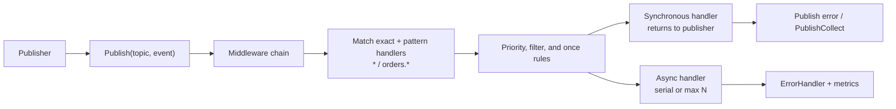

<p align="center">
  
</p>
<h1 align="center">Townbell Bus</h1>
<p align="center"><strong>A dependency-free, type-safe event bus for Go applications.</strong></p>

<p align="center">
  <a href="https://github.com/townbell/bus/actions/workflows/ci.yml"></a>
  <a href="https://pkg.go.dev/github.com/townbell/bus"></a>
  <a href="https://github.com/townbell/bus/blob/main/LICENSE"></a>
  
</p>

`bus` is for in-process event dispatch: no broker, no runtime dependency, and
no serialization layer. It gives a Go application type-safe fan-out, bounded
asynchronous work, priority, filters, middleware, and observable failures.

[中文文档](README_ZH.md) · [API reference](https://pkg.go.dev/github.com/townbell/bus) · [Examples](example/README.md) · [Migration from v0.5.x](MIGRATION.md)

> **API preview.** Since v0.6.0, subscriptions use one
> `Subscribe(topic, handler, options...)` method, handlers return `error`, and
> `Publish` returns synchronous delivery failures. This API is intended to
> freeze at v1.0.0; feedback is welcome before then.

## Why Townbell?

| Need | What you get |
| --- | --- |
| Keep one process decoupled | Typed topics, fan-out, exact and hierarchical topic patterns |
| Move slow work off the request path | Async handlers with serial or bounded-concurrency execution |
| Make failures visible | Joined publish errors, per-error collection, panic recovery, error hooks, metrics |
| Stop safely | Context-aware handlers, `WaitAsync`, and graceful `Close` |

If an event must survive a process restart or cross machine boundaries, use a
durable broker. Townbell deliberately stays on the lightweight side of that
boundary.

## Dispatch model



## Install

```bash
go get github.com/townbell/bus
```

The core module only imports the Go standard library. Prometheus support is
optional and lives in its own module:

```bash
go get github.com/townbell/bus/prometheus
```

## Quick start

```go
package main

import (
    "context"
    "fmt"

    "github.com/townbell/bus"
)

type UserEvent struct {
    ID     string
    Action string
}

func main() {
    b := bus.NewTyped[UserEvent]()
    defer b.Close()

    handle, err := b.Subscribe("user.login", func(ctx context.Context, event UserEvent) error {
        fmt.Printf("%s: %s\n", event.ID, event.Action)
        return nil
    })
    if err != nil {
        panic(err)
    }
    defer handle.Unsubscribe()

    if err := b.Publish("user.login", UserEvent{ID: "u-1", Action: "login"}); err != nil {
        fmt.Println("delivery failed:", err)
    }
}
```

## Pick a path

| I want to… | Start here | It demonstrates |
| --- | --- | --- |
| Learn the API | [`basic_example.go`](example/basic_example.go) | Typed subscriptions, options, async delivery |
| Configure dispatch | [`advanced_usage.go`](example/advanced_usage.go) | Priority, filters, context, timeout, metrics |
| Instrument every event | [`middleware_example.go`](example/middleware_example.go) | Middleware ordering and interception |
| Publish from HTTP | [`http_example.go`](example/http_example.go) | Request contexts, patterns, dead events, shutdown |
| Run local background jobs | [`worker_example.go`](example/worker_example.go) | Async work, `HandlerMaxConcurrency`, error hooks, draining |
| Follow a larger flow | [`e_commerce_example.go`](example/e_commerce_example.go) | Domain events, priorities, compensation |

Run any example from its directory:

```bash
cd example && go run worker_example.go
```

## Delivery semantics

| Concern | Contract |
| --- | --- |
| `Publish` | Runs synchronous handlers in priority order and returns their joined errors. Later handlers still run after an ordinary error. |
| `PublishCollect` | Returns every synchronous failure in dispatch order when callers need to retry, classify, or log separately. |
| Async handlers | Return before the handler finishes; failures are reported only through `ErrorHandler`. Use async to free the caller, not to make CPU work faster. |
| Patterns | `*` matches every topic. `orders.*` matches `orders.created` and deeper descendants, but not `orders`. |
| Context and timeout | Cancellation stops later synchronous dispatch and is passed to the current handler. Handlers must honor their context to stop promptly. |
| Shutdown | `Close` rejects new publish/subscribe calls and waits for already-started async work. Call `WaitAsync` when a process must drain earlier. |

Useful options compose in one subscription:

```go
b.Subscribe("payment.validate", validate,
    bus.HandlerPriority(bus.PriorityHigh),
    bus.HandlerTimeout(2*time.Second),
    bus.HandlerRecoverPolicy(bus.RecoverAndStop),
    bus.HandlerMaxConcurrency(4),
)
```

Available options: `HandlerPriority`, `HandlerFilter`, `HandlerContext`,
`HandlerAsync`, `HandlerOnce`, `HandlerTimeout`, `HandlerRecoverPolicy`,
`HandlerMaxConcurrency`, and `HandlerSerial`.

## Features at a glance

| Area | Included |
| --- | --- |
| Routing | Exact topics, `*`, hierarchical `prefix.*`, dead-event hook |
| Execution | Sync/async handlers, priority, once, filter, context, timeout, serial or bounded concurrency |
| Reliability | Panic recovery, publish error returns, `ErrorHandler`, safe handles, graceful close |
| Observability | Global counts plus per-topic and per-handler snapshots; optional Prometheus adapter |
| Performance | Copy-on-write subscription slices keep an unchanged synchronous publish path allocation-free |

## Project status

| Status | Milestone | Scope |
| --- | --- | --- |
| ✅ | v0.6 API convergence | One options-based `Subscribe`; error-returning handlers and publishing |
| ✅ | v0.8 publish hot path | Copy-on-write handler snapshots and zero-allocation synchronous publishing |
| ✅ | v0.9 result collection | `PublishCollect` exposes individual synchronous delivery failures |
| ✅ | v0.11 P2 integration examples | Runnable Gin service and standard-library CLI lifecycle guide |
| Planned | v1.0 API freeze | Audit preview contracts, settle any compatibility feedback, then freeze the core API and migration guidance |
| Planned | P3 broker bridge | Design one transport-specific adapter as a separate module; define delivery, retry, and shutdown semantics before code |
| Planned | P4 mediator mode | Validate a concrete application use case and publish it as an optional package, not a `Bus` concern |
| Planned | P5 stateful capability | Keep state, persistence, and recovery outside the core; require a separate design proposal and ownership model |

The ordered path after v0.11 is API-freeze readiness, then v1.0. P3–P5 are
intentionally optional modules: each needs a dedicated proposal, explicit
dependency and delivery guarantees, and its own release cadence before work
starts. None should add a runtime dependency to the core module.

## Quality and performance

The CI matrix builds, vets, runs race tests, checks formatting, and enforces a
90% core coverage floor. The core benchmark suite measures parallel publishing;
run it on your hardware before making latency claims.

```bash
go test -race ./...
(cd prometheus && go test -race ./...)
go test -bench=. -benchmem
```

## Contributing

Issues and pull requests are welcome. Please keep the core dependency-free,
add a focused test for behavioral changes, and run the quality commands above.

## License

[MIT](LICENSE)
