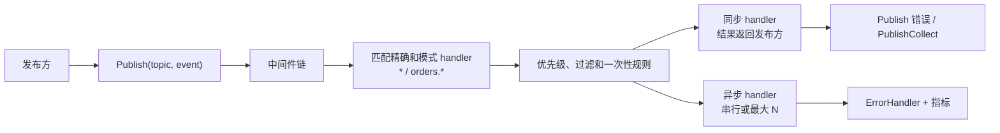

<p align="center">
  
</p>
<h1 align="center">Townbell Bus</h1>
<p align="center"><strong>为 Go 应用提供零依赖、类型安全的进程内事件总线。</strong></p>

<p align="center">
  <a href="https://github.com/townbell/bus/actions/workflows/ci.yml"></a>
  <a href="https://pkg.go.dev/github.com/townbell/bus"></a>
  <a href="https://github.com/townbell/bus/blob/main/LICENSE"></a>
  
</p>

`bus` 专注于进程内事件派发：没有消息代理、运行时依赖或序列化层。它为 Go 应用提供类型安全的扇出、受控异步执行、优先级、过滤器、中间件，以及可观测的失败处理。

[English](README.md) · [API 参考](https://pkg.go.dev/github.com/townbell/bus) · [示例](example/README_ZH.md) · [从 v0.5.x 迁移](MIGRATION_ZH.md)

> **API 试运行中。** 自 v0.6.0 起，订阅统一为
> `Subscribe(topic, handler, options...)`；handler 返回 `error`，`Publish`
> 返回同步派发失败。这套 API 计划在 v1.0.0 冻结，冻结前欢迎反馈。

## 为什么选择 Townbell？

| 你的需求 | 得到的能力 |
| --- | --- |
| 解耦同一进程内的模块 | 类型安全 topic、扇出、精确和层级 topic 模式 |
| 把慢操作移出请求路径 | 异步 handler，支持串行或限制最大并发 |
| 让失败真正可见 | 合并发布错误、逐项错误收集、panic 恢复、错误钩子、指标 |
| 安全退出 | 感知 context 的 handler、`WaitAsync` 与优雅 `Close` |

如果事件必须跨进程、跨机器，或在重启后仍然存在，请使用持久化消息代理。Townbell 有意保持在这条边界的轻量一侧。

## 派发模型



## 安装

```bash
go get github.com/townbell/bus
```

核心模块只导入 Go 标准库。Prometheus 支持是可选的独立模块：

```bash
go get github.com/townbell/bus/prometheus
```

## 快速开始

```go
package main

import (
    "context"
    "fmt"

    "github.com/townbell/bus"
)

type UserEvent struct {
    ID     string
    Action string
}

func main() {
    b := bus.NewTyped[UserEvent]()
    defer b.Close()

    handle, err := b.Subscribe("user.login", func(ctx context.Context, event UserEvent) error {
        fmt.Printf("%s: %s\n", event.ID, event.Action)
        return nil
    })
    if err != nil {
        panic(err)
    }
    defer handle.Unsubscribe()

    if err := b.Publish("user.login", UserEvent{ID: "u-1", Action: "login"}); err != nil {
        fmt.Println("派发失败:", err)
    }
}
```

## 按场景选示例

| 想做什么 | 从这里开始 | 你会看到 |
| --- | --- | --- |
| 熟悉 API | [`basic_example.go`](example/basic_example.go) | 类型安全订阅、选项、异步派发 |
| 配置派发行为 | [`advanced_usage.go`](example/advanced_usage.go) | 优先级、过滤、context、超时、指标 |
| 观测每一个事件 | [`middleware_example.go`](example/middleware_example.go) | 中间件顺序和拦截 |
| 从 HTTP 发布事件 | [`http_example.go`](example/http_example.go) | 请求 context、模式、dead event、退出 |
| 运行本地后台任务 | [`worker_example.go`](example/worker_example.go) | 异步任务、`HandlerMaxConcurrency`、错误钩子、排空 |
| 了解完整业务流 | [`e_commerce_example.go`](example/e_commerce_example.go) | 领域事件、优先级、补偿 |

在 `example` 目录中单独运行任一示例：

```bash
cd example && go run worker_example.go
```

## 派发语义

| 关注点 | 约定 |
| --- | --- |
| `Publish` | 按优先级运行同步 handler，返回这些 handler 的合并错误。普通错误不会阻止后续 handler。 |
| `PublishCollect` | 需要分别重试、分类或记录时，按派发顺序返回每一项同步失败。 |
| 异步 handler | 发布调用会先返回；失败只通过 `ErrorHandler` 上报。异步的目的是释放调用方，而不是让 CPU 工作变快。 |
| 模式 | `*` 匹配全部 topic；`orders.*` 匹配 `orders.created` 及更深层级，但不匹配 `orders` 本身。 |
| Context 与超时 | 取消会停止后续同步派发，并传递给当前 handler。handler 必须配合检查 context 才能及时停止。 |
| 关闭 | `Close` 拒绝新的发布和订阅，并等待已启动的异步工作；需要提前排空时调用 `WaitAsync`。 |

一个订阅中的常用选项可以自由组合：

```go
b.Subscribe("payment.validate", validate,
    bus.HandlerPriority(bus.PriorityHigh),
    bus.HandlerTimeout(2*time.Second),
    bus.HandlerRecoverPolicy(bus.RecoverAndStop),
    bus.HandlerMaxConcurrency(4),
)
```

可用选项：`HandlerPriority`、`HandlerFilter`、`HandlerContext`、`HandlerAsync`、`HandlerOnce`、`HandlerTimeout`、`HandlerRecoverPolicy`、`HandlerMaxConcurrency`、`HandlerSerial`。

## 能力一览

| 领域 | 已提供 |
| --- | --- |
| 路由 | 精确 topic、`*`、层级 `prefix.*`、dead-event 钩子 |
| 执行 | 同步/异步 handler、优先级、一次性、过滤、context、超时、串行或限并发 |
| 可靠性 | panic 恢复、发布错误返回、`ErrorHandler`、安全 handle、优雅关闭 |
| 可观测性 | 全局计数和 topic / handler 维度快照；可选 Prometheus 适配器 |
| 性能 | 订阅列表 copy-on-write，未变更时的同步发布路径保持零分配 |

## 项目状态

| 状态 | 里程碑 | 范围 |
| --- | --- | --- |
| ✅ | v0.6 API 收敛 | 一个基于选项的 `Subscribe`；handler 与发布均可返回错误 |
| ✅ | v0.8 发布热路径 | handler 快照 copy-on-write，同步发布零分配 |
| ✅ | v0.9 错误收集 | `PublishCollect` 暴露每一项同步派发失败 |
| 🚧 | P2 集成示例 | 已提供 `net/http` 和本地 worker 示例；Gin、CLI 指南待补充 |
| 计划中 | P3+ | 可选 broker 桥接、Mediator 模式、状态型能力——均不进入核心模块 |

## 质量与性能

CI 在 Go 版本矩阵上执行构建、vet、race test 和格式检查，并对核心模块强制 90% 覆盖率下限。基准测试衡量并行发布；在对延迟做结论前请先在自己的硬件上复测。

```bash
go test -race ./...
(cd prometheus && go test -race ./...)
go test -bench=. -benchmem
```

## 贡献

欢迎提交 Issue 和 Pull Request。请保持核心模块零依赖；行为变化请补充聚焦测试，并运行上面的质量命令。

## 许可证

[MIT](LICENSE)
